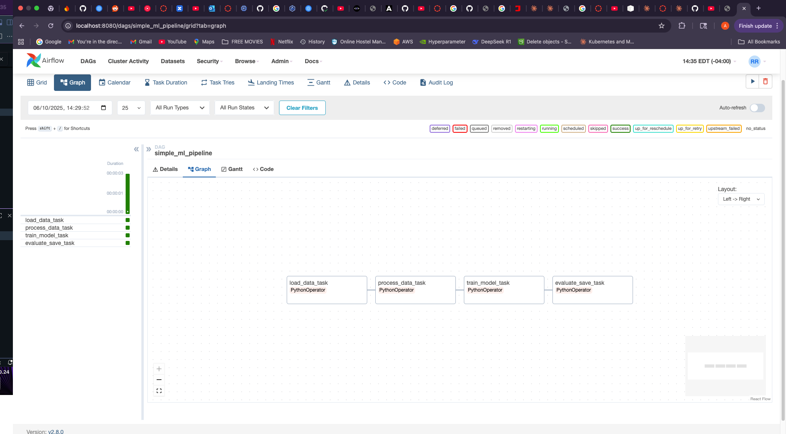
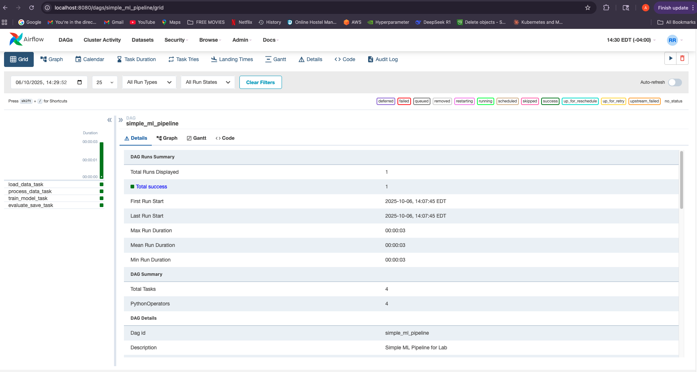

# Apache Airflow ML Pipeline Lab

## Project Overview
This lab demonstrates the setup and deployment of Apache Airflow using Docker to orchestrate a machine learning pipeline. The project includes a 4-stage data processing workflow that simulates a real-world ML training and deployment scenario.

## Architecture
- **Orchestration**: Apache Airflow 2.8.0
- **Containerization**: Docker & Docker Compose
- **Database**: PostgreSQL (metadata storage)
- **Message Broker**: Redis
- **Executor**: CeleryExecutor

## Project Structure
```
Airflow Lab/
├── dags/
│   └── simple_ml_pipeline.py    # Main DAG file with ML pipeline
├── logs/                         # Airflow execution logs (auto-generated)
├── config/                       # Airflow configuration
├── plugins/                      # Custom plugins (if any)
├── docker-compose.yaml           # Service orchestration
├── Dockerfile                    # Custom Airflow image (optional)
├── requirements.txt              # Python dependencies
├── .env                         # Environment variables (AIRFLOW_UID=501)
└── README.md                    # This file
```

## Pipeline Description

### DAG: simple_ml_pipeline
A 4-stage sequential machine learning pipeline that demonstrates core Airflow concepts:

1. **load_data_task**: Simulates data ingestion (1000 records)
2. **process_data_task**: Data preprocessing and transformation
3. **train_model_task**: Model training with metrics calculation (92% accuracy)
4. **evaluate_save_task**: Model evaluation and deployment decision

### Key Features
- **XCom Usage**: Tasks communicate data using Airflow's XCom feature
- **Context Passing**: Downstream tasks access upstream results
- **Conditional Logic**: Deployment based on accuracy threshold (>85%)
- **Error Handling**: Retry logic with 2-minute delays
- **Manual Triggering**: No automatic scheduling for controlled execution

## Setup Instructions

### Prerequisites
- Docker Desktop installed with 4GB+ RAM allocated
- Docker Compose installed
- macOS/Linux/Windows with WSL2

### Installation Steps

1. **Clone/Create project structure**:
```bash
mkdir -p "Airflow Lab" && cd "Airflow Lab"
mkdir -p dags logs plugins config
```

2. **Download Airflow Docker Compose**:
```bash
curl -LfO 'https://airflow.apache.org/docs/apache-airflow/2.8.0/docker-compose.yaml'
```

3. **Set environment variables**:
```bash
echo "AIRFLOW_UID=501" > .env
```

4. **Initialize Airflow**:
```bash
docker compose up airflow-init
```

5. **Start services**:
```bash
docker compose up -d
```

6. **Access Airflow UI**:
- URL: http://localhost:8080
- Username: `airflow`
- Password: `airflow`

## Running the Pipeline

1. Navigate to http://localhost:8080
2. Find `simple_ml_pipeline` in the DAGs list
3. Toggle the DAG to "ON" using the switch
4. Click the play button (▶️) to trigger execution
5. Monitor progress in Graph View

## Pipeline Execution Results

### Successful Run Metrics
- **Total Run Duration**: 00:00:03
- **Tasks Completed**: 4/4
- **Success Rate**: 100%
- **Model Accuracy**: 92%
- **Final Status**: Model Deployed

### Task Execution Flow
```
load_data_task (✓) → process_data_task (✓) → train_model_task (✓) → evaluate_save_task (✓)
```

## Technical Implementation

### DAG Configuration
```python
default_args = {
    'owner': 'student',
    'depends_on_past': False,
    'start_date': datetime(2025, 1, 1),
    'retries': 1,
    'retry_delay': timedelta(minutes=2)
}
```

### Data Flow
- Tasks communicate via XCom
- Data passed: dictionaries with records count and status
- Model metrics: accuracy, precision, recall
- Final decision: deployed/rejected based on threshold

## Lessons Learned

1. **Airflow Architecture**: Understanding the relationship between webserver, scheduler, and workers
2. **DAG Development**: Creating modular, reusable task functions
3. **Docker Networking**: Services communicate within Docker network
4. **Dependency Management**: Tasks execute in defined order with proper error handling
5. **Monitoring**: Using Airflow UI for pipeline observation and debugging

## Troubleshooting

### Common Issues & Solutions

1. **DAG not appearing**:
   - Ensure file is in `dags/` folder
   - Check for Python syntax errors
   - Restart scheduler: `docker compose restart airflow-scheduler`

2. **AIRFLOW_UID warning**:
   - Set in .env file: `AIRFLOW_UID=501`

3. **Port 8080 in use**:
   - Stop conflicting service or change port in docker-compose.yaml

4. **Import errors**:
   - Use `from airflow.operators.python import PythonOperator` (not python_operator)

## Commands Reference

```bash

docker compose ps

#check logs
docker compose logs airflow-scheduler
docker compose logs airflow-webserver


docker compose exec airflow-webserver airflow dags list


docker compose exec airflow-webserver airflow dags trigger simple_ml_pipeline

docker compose down

docker compose down -v
```

## Future Enhancements

- Add real ML model training with scikit-learn
- Implement data validation using Great Expectations
- Add email notifications on failure
- Create branching workflow based on data quality
- Integrate with cloud storage (S3/GCS)
- Add MLflow for experiment tracking

## Submission Details

- **Student**: [Arav Pandey]
- **Course**: MLOps / Data Analytics Engineering
- **Assignment**: Apache Airflow Lab
- **Date**: October 6, 2025
- **Status**: ✅ Completed

## Screenshots

1. DAG Graph View 


2. DAG Details View


## References

- [Apache Airflow Documentation](https://airflow.apache.org/docs/)
- [Docker Compose for Airflow](https://airflow.apache.org/docs/apache-airflow/stable/howto/docker-compose/index.html)
- [Airflow Best Practices](https://airflow.apache.org/docs/apache-airflow/stable/best-practices.html)

---

*This project demonstrates proficiency in workflow orchestration, containerization, and MLOps practices using industry-standard tools.*